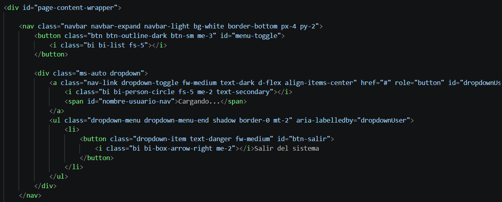
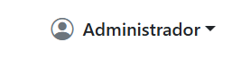
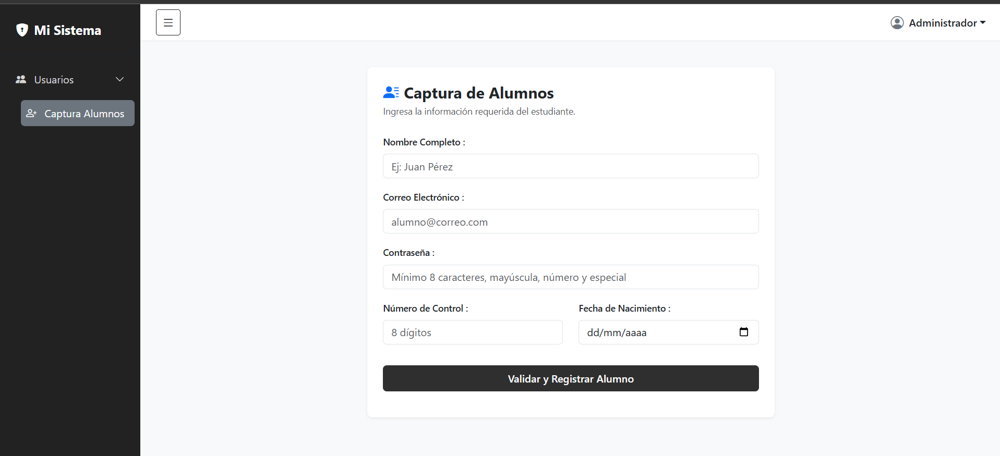
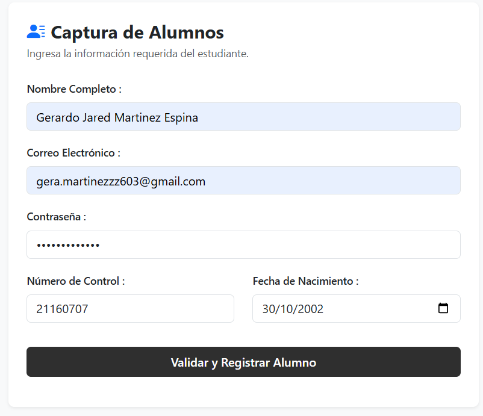
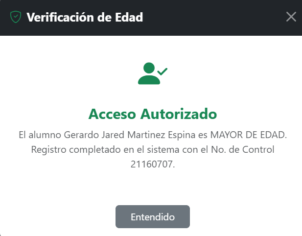

# Sistema de Login

## Integrantes

- Jorge Emilio Nuñez Reyes
- Gerardo Jared Martinez Espina

---
# Github Pages
https://emilioreyes2219.github.io/Login/
---

# Descripción

Este proyecto consiste en un sistema web completo de autenticación y gestión simulada de alumnos, distribuido en dos pantallas interconectadas de manera segura mediante el almacenamiento local del navegador, sin dependencias de backend.

1. **`login.html`**: Pantalla de acceso que valida credenciales frente a una lista de usuarios predefinidos.
2. **`index.html`**: Panel principal protegido (dashboard) con un menú lateral colapsable, barra superior personalizada y un formulario de captura de estudiantes.

Al iniciar sesión correctamente, el usuario es redirigido a la página principal del sistema (`index.html`).

---

# Framework CSS utilizado

Se utilizó **Bootstrap 5** como framework CSS para facilitar el diseño responsivo de los formularios, botones, navbar y estructura general de la aplicación.

Además, se complementó con estilos personalizados en archivos CSS para obtener una apariencia minimalista con predominio de colores blancos, grises y tonos oscuros.

---

# Flujo del Login

El funcionamiento implementado es el siguiente:

1. El usuario ingresa su correo electrónico.
2. Ingresa su contraseña.
3. Se validan ambos campos utilizando la librería `utileria.js`.
4. Si el usuario existe dentro de los usuarios simulados, se guarda su información en `localStorage`.
5. El sistema redirige automáticamente a `index.html`.
6. En la página principal se recupera el nombre del usuario desde `localStorage` para mostrarlo en el navbar.

---

# Paso del nombre del usuario al Navbar

Después de validar correctamente el inicio de sesión, el nombre del usuario se almacena utilizando `localStorage`.

```javascript
localStorage.setItem("usuario", usuario.nombre);
```

Posteriormente, al cargar `index.html`, el nombre almacenado se obtiene mediante:

```javascript
const usuario = localStorage.getItem("usuario");
```

Finalmente, el nombre es mostrado en el navbar para simular una sesión iniciada.

---

# Métodos principales utilizados

### Login

- `Util.validarCorreo()`
- `Util.validarPassword()`
- `localStorage.setItem()`
- `window.location.href`

### Navbar

- `localStorage.getItem()`
- `localStorage.removeItem()`

---

# Proceso de creación

## 1. Diseño del Login

Se diseñó una interfaz moderna utilizando Bootstrap y estilos personalizados con una distribución de dos columnas, una sección de bienvenida y un formulario de inicio de sesión.


---

## 2. Validación del Login

Se integró la librería `utileria.js` para validar el formato del correo electrónico y verificar que la contraseña cumpliera con los requisitos mínimos establecidos.

Posteriormente se comparan los datos contra una lista de usuarios simulados.


---

## 3. Diseño del Navbar

Se implementó un navbar superior que mostrará el nombre del usuario autenticado.

El nombre se obtiene desde `localStorage`, simulando una sesión iniciada.




---


## Login 


---

## Usuario mostrado en el Navbar



---


## 🧱 Desarrollo de Módulos Restantes

### 1. Sidebar (Menú Lateral) y Menú Usuarios
[cite_start]Se maquetó un contenedor lateral fijo (`#sidebar-wrapper`) utilizando estilos oscuros integrados con Bootstrap 5 para el diseño responsivo[cite: 145, 151]. 
* **Menú Desplegable:** Se implementó la opción **Usuarios** mediante el componente `collapse` de Bootstrap, el cual despliega de forma animada el submenú **Captura Alumnos** al hacerle clic.
* **Botón Hamburguesa:** En la barra superior se integró un botón con el ícono `bi-list`. [cite_start]Mediante JavaScript en `dashboard.js`, este botón altera la clase `.toggled` del contenedor principal, permitiendo contraer o expandir el menú lateral para optimizar el espacio de trabajo en pantallas pequeñas[cite: 151, 158].

### 2. Formulario de Captura y Campo Número de Control
Dentro de la zona central se diseñó una tarjeta limpia que aloja el formulario de captura para nuevos estudiantes.
* **Campos Estándar:** Incluye Nombre Completo, Correo Electrónico y Contraseña, los cuales son validados rigurosamente en tiempo real consumiendo los métodos `Util.soloLetras()`, `Util.validarCorreo()` y `Util.validarPassword()` de nuestra librería compartida `utileria.js`.
* **Número de Control (8 dígitos):** Se añadió un campo de texto limitado mediante el atributo HTML `maxlength="8"`. Al procesar el formulario, JavaScript limpia cualquier carácter no numérico mediante expresiones regulares y evalúa con el método obligatorio `Util.validarLongitud(ncontrol, 8)` que contenga exactamente los 6 dígitos numéricos requeridos antes de permitir el registro.

### 3. Modal para Validar Mayoría de Edad
Para evitar el uso de alertas nativas del navegador, se integró un componente `<div class="modal fade">` de Bootstrap 5 oculto en la estructura del documento.
* **Lógica de Activación:** Al presionar "Validar y Registrar Alumno", el script captura la fecha de nacimiento seleccionada y la evalúa con la función `Util.esMayorDeEdad()`.
* [cite_start]**Inyección Dinámica del DOM:** Si el método devuelve verdadero, JavaScript inyecta un ícono verde (`bi-person-check-fill`) junto al título "Acceso Autorizado"[cite: 157]. [cite_start]Si es menor de edad, se altera el DOM para mostrar un ícono rojo (`bi-person-x-fill`) y un mensaje de restricción[cite: 157].
* **Despliegue:** El cuadro emerge en pantalla de forma interactiva utilizando la API nativa del framework: `modalBootstrap.show()`.

### 4. GitHub Pages e Interconexión del Sistema
El proyecto fue desplegado con éxito en los servidores de GitHub Pages, garantizando la persistencia del flujo completo:
1. El usuario inicia sesión de forma simulada en `login.html`.
2. Al ser válido, los datos se guardan en el `localStorage` y es redirigido a `index.html`.
3. Dentro de `index.html`, el script de seguridad bloquea el acceso si no existe sesión activa, y el navbar recupera el nombre del usuario para pintarlo en el Dropdown superior.
4. Al hacer clic en **"Salir del sistema"**, se destruye el `localStorage` y el flujo retorna limpiamente a la pantalla de acceso.

---

## 📸 Evidencias de los Módulos Agregados

### Panel Principal con Sidebar y Nombre de Usuario

### Formulario requicitado correctamente

### Modal de Mayoría de Edad (Acceso Autorizado)
