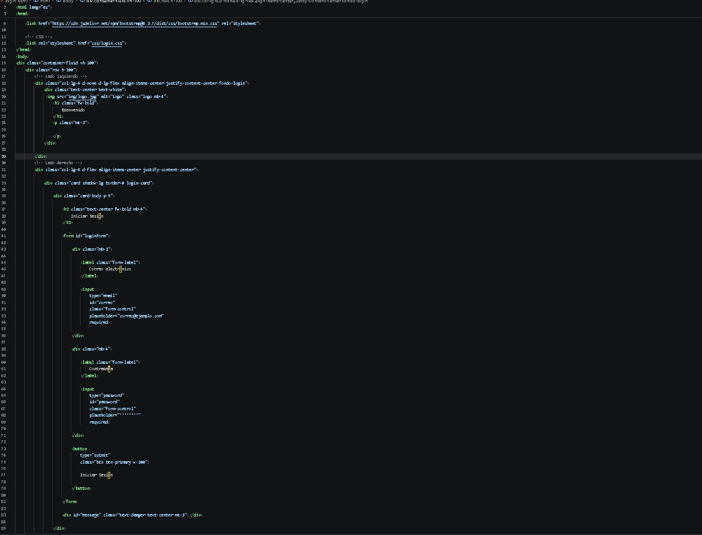
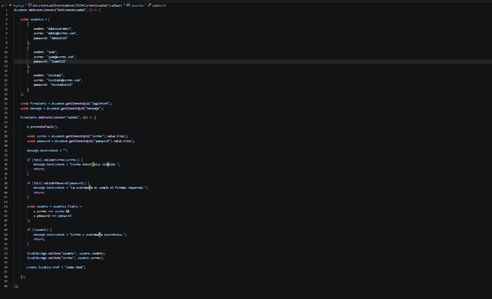
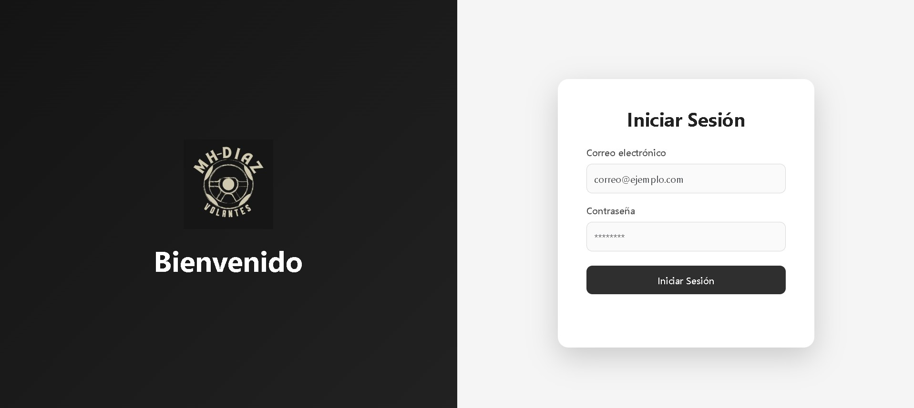

# Sistema de Login

## Integrantes

- Jorge Emilio Nuñez Reyes
- Pon tu nombre

---

# Descripción

Este proyecto consiste en un sistema de inicio de sesión desarrollado con HTML, CSS y JavaScript. El acceso al sistema es simulado mediante usuarios predefinidos, sin utilizar una base de datos.

Al iniciar sesión correctamente, el usuario es redirigido a la página principal del sistema (`index.html`).

---

# Framework CSS utilizado

Se utilizó **Bootstrap 5** como framework CSS para facilitar el diseño responsivo de los formularios, botones, navbar y estructura general de la aplicación.

Además, se complementó con estilos personalizados en archivos CSS para obtener una apariencia minimalista con predominio de colores blancos, grises y tonos oscuros.

---

# Flujo del Login

El funcionamiento implementado es el siguiente:

1. El usuario ingresa su correo electrónico.
2. Ingresa su contraseña.
3. Se validan ambos campos utilizando la librería `utileria.js`.
4. Si el usuario existe dentro de los usuarios simulados, se guarda su información en `localStorage`.
5. El sistema redirige automáticamente a `index.html`.
6. En la página principal se recupera el nombre del usuario desde `localStorage` para mostrarlo en el navbar.

---

# Paso del nombre del usuario al Navbar

Después de validar correctamente el inicio de sesión, el nombre del usuario se almacena utilizando `localStorage`.

```javascript
localStorage.setItem("usuario", usuario.nombre);
```

Posteriormente, al cargar `index.html`, el nombre almacenado se obtiene mediante:

```javascript
const usuario = localStorage.getItem("usuario");
```

Finalmente, el nombre es mostrado en el navbar para simular una sesión iniciada.

---

# Métodos principales utilizados

### Login

- `Util.validarCorreo()`
- `Util.validarPassword()`
- `localStorage.setItem()`
- `window.location.href`

### Navbar

- `localStorage.getItem()`
- `localStorage.removeItem()`

---

# Proceso de creación

## 1. Diseño del Login

Se diseñó una interfaz moderna utilizando Bootstrap y estilos personalizados con una distribución de dos columnas, una sección de bienvenida y un formulario de inicio de sesión.



---

## 2. Validación del Login

Se integró la librería `utileria.js` para validar el formato del correo electrónico y verificar que la contraseña cumpliera con los requisitos mínimos establecidos.

Posteriormente se comparan los datos contra una lista de usuarios simulados.




---

## 3. Diseño del Navbar

Se implementó un navbar superior que mostrará el nombre del usuario autenticado.

El nombre se obtiene desde `localStorage`, simulando una sesión iniciada.

**Captura**

*(Insertar captura aquí)*

---

# Capturas del funcionamiento

## Pantalla de Login

*(Insertar captura aquí)*

---

## Login 



---

## Usuario mostrado en el Navbar

*(Insertar captura aquí)*

---


- Sidebar.
- Menú Usuarios.
- Formulario de captura.
- Número de control.
- Modal para validar mayoría de edad.
- GitHub Pages.
- Documentación restante.
